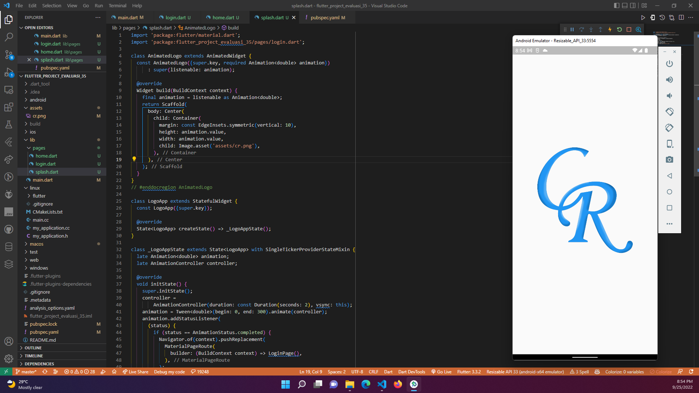
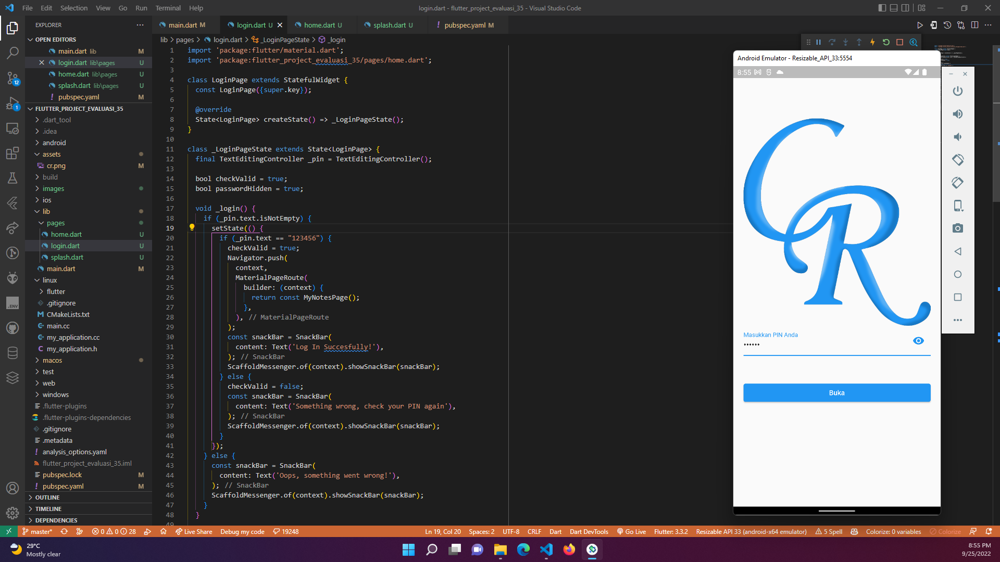
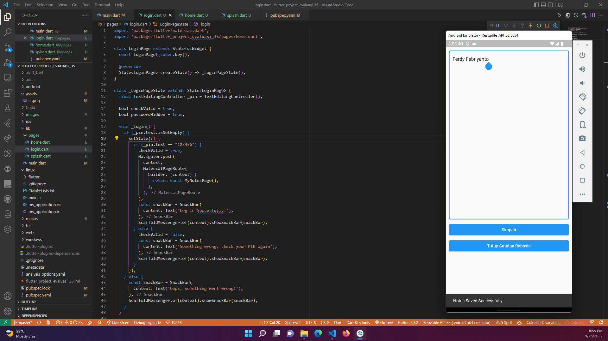

# Evaluasi Pekan 7

## Studi Kasus

* Membuat aplikasi catatan rahasia
* Memiliki fitur splash screen
* Memiliki fitur login berupa pin
* Memiliki fitur menambahkan catatan
* Mengimplementasikan shared preferences

## Hasil 

* Gambar diatas adalah halaman splash screen, yang muncul selama 3 detik

* Gambar diatas adalah halaman auth, yang muncul ketika aplikasi pertama kali dijalankan. Memasukkan pin 123456 agar dapat masuk ke aplikasi.

* Gambar diatas adalah halaman utama, yang muncul ketika aplikasi berhasil login. Terdapat tombol tambah catatan untuk menambahkan catatan baru. Meskipun aplikasi ditutup, catatan yang sudah dibuat akan tetap tersimpan.